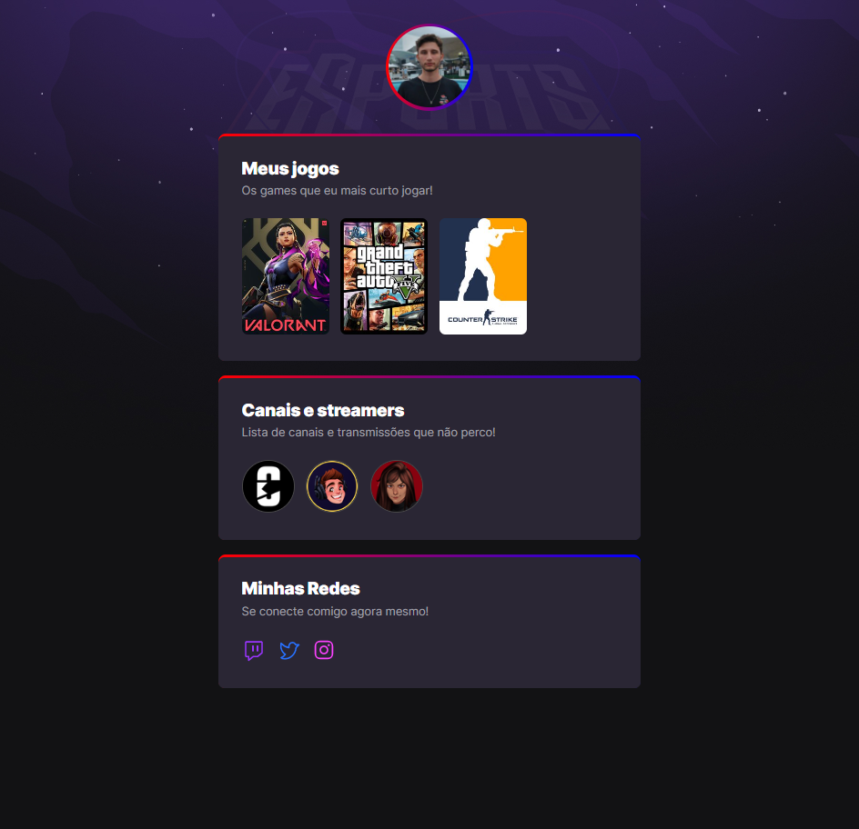

# NLW eSports

>Trilha Explorer

Projeto construido do evento Next Level Week da
Rocketseat.

[🔗 Clique aqui para acessar](https://angelobonetti.github.io/NLW---eSports/)

## Tecnologias

- HTML
- CSS
- Git e Github

## Como foi desenvolvido?
- Visualizado as aulas durante a semana, de segunda a quinta.
- Sexta foi desenvolvido o projeto de acordo com o material do Figma.
- Feito algumas alterações.

## Motivo do projeto
- Treinar minhas habilidades em HTML e CSS.
## Contato
angeloaiure@hotmail.com
